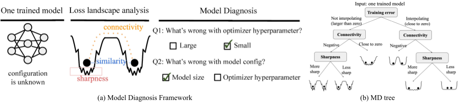

# MD tree: a model-diagnostic tree grown on loss landscape [ICML 2024]


## Introduction
This work introduces a framework of model diagnosis, which we formulate as a classification problem. Given a pre-trained neural network (NN), the goal is to predict the source of failure from a set of failure modes (such as a wrong hyperparameter, inadequate model size, and insufficient data) without knowing the training configuration of the pre-trained NN. This repository includes the preparation of diagnosis datasets, implementation of different diagnosis methods, and different ways to evaluate the diagnosis performance.

<p align="center">

</p>

**Caption**: (a) Overview of our model-diagnostic framework using MD tree. This framework is designed to analyze and diagnose NNs where the training configuration is unknown.  (b) MD tree based on loss landscape structure of trained models.

## Setup
```bash
conda create -n model_diagnosis python=3.8
conda activate model_diagnosis
pip install requirements.txt
```

## &#x1F50E; Model Diagnosis Dataset 
The Model Diagnosis Dataset is a collection of trained models. Each sample in the dataset represents a different training configuration and includes five models trained with different random seeds under that configuration. The preprocessed dataset has been provided in `model_diagnosis_dataset/`.

Check the [folder](https://github.com/YefanZhou/ModelDiag_dev/tree/main/model_diagnosis_dataset) to access the data and details of the dataset, and how to preprocess the dataset. The preprocessing includes the following steps: 1) convert the unstructured metric data to structures such as dictionary/dataframe, 2) compute the room for improvement (RFI) metric, which quantifies the impact of a specific failure source 3) labeling the most severe failure sources for diagnosis task.


## Experiments 
Here are the instructions for reproducing the experiments from the paper. We studied two types of evaluation criteria: the first evaluates the accuracy of diagnosis methods, and the second assesses the performance improvement of a pre-trained NN after a one-step hyperparameter change guided by model diagnosis methods.

### Evaluating Diagnosis Accuracy
In this section, we focus on evaluating diagnosis accuracy under two tasks, Q1 and Q2. Each task considers two transfer scenarios: dataset transfer and scale transfer. For complete details, see Section 4 of the paper.
#### Q1: Predict the optimizer hyperparameter is large or small
```bash
# dataset transfer
bash scripts/q1_predict_temp_dataset_transfer.sh

# scale transfer
bash scripts/q1_predict_temp_scale_transfer.sh
```
The results will be saved in `results/` directory. Use `vis/q1_predict_opt.ipynb` to visualize the results and reproduce the figures in the paper.

#### Q2: Predict the failure source is model size (or data amount) or optimizer hyperparameter
```bash
# Model size vs. optimizer hyperparameter 
bash scripts/q2_predict_width_temp.sh

# Data amount vs. optimizer hyperparameter
bash scripts/q2_predict_data_temp.sh
```
The results will be saved in `results/` directory. Use `vis/q2_predict_width_vs_opt.ipynb` to visualize the results and reproduce the figures in the paper.


### One-step Hyperparameter Change
In this section, we focus on determining a "one-step configuration change" to improve the test performance of a pre-trained NN. For complete details, see Appendix A of the paper.
```bash
cd one_step
# random and optimal diagnosis 
bash baseline_optimal_random_method.sh

# Hyperparameter validation metric diagnosis
bash baseline_hyper_validation_method.sh

# MD tree diagnosis (Ours)
bash md_tree.sh
```
The results will be saved in `one_step/hpo_results` directory.


## Benchmark
We provide a benchmark that lists the various tasks and scenarios studied in the paper. This benchmark is used to compare different model diagnosis methods and features. Please refer to the [folder](https://github.com/YefanZhou/ModelDiag_dev/tree/main/benchmark) for more details.


## Contact
Feel free to get in touch with us with any questions on the project or to request access to data and pretrained models. Reach out to `yefan.zhou.gr@dartmouth.edu`.


## Citation
We would appreciate it if you could cite the following paper if you found the repository useful for your work:
```bash
@inproceedings{
zhou2024md,
title={{MD} tree: a model-diagnostic tree grown on loss landscape},
author={Yefan Zhou and Jianlong Chen and Qinxue Cao and Konstantin Sch{\"u}rholt and Yaoqing Yang},
booktitle={Forty-first International Conference on Machine Learning},
year={2024},
}
```

## Contribution
Yefan Zhou contributed to the implementation of diagnosis framework and methods, and evaluation of diagnosis accuracy. [Jianlong Chen](https://github.com/Car-pe) contributed to the experiments of one-step hyperparameter change, and dataset preparation. 


## License
This project is licensed under the MIT License.
